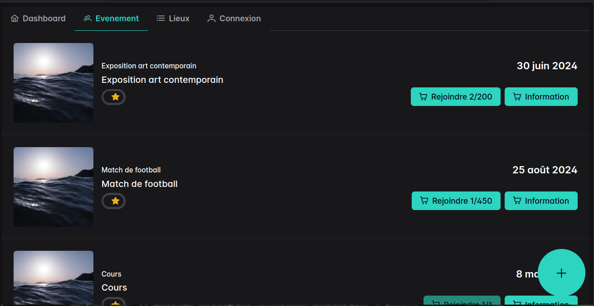

# Gestion des événements d'une association

L'application gère les événements d'une association et de ses membres. Elle permet de créer, modifier et supprimer des membres et des événements, ainsi que de visualiser les informations relatives aux membres, aux événements, aux inscriptions et aux lieux.

## Fonctionnalités

- Visualiser l'ensemble des membres de l'association
- Visualiser l'ensemble des événements (tous ou ceux à venir)
- Visualiser l'ensemble des inscriptions pour un événement donné (avec le nombre d'inscrits)
- Pour chaque membre, pouvoir lister les événements auxquels il est inscrit (tous ou ceux à venir)
- Créer, modifier et supprimer de nouveaux membres ou événements
- Afficher les événements d'un lieu (tous ou ceux à venir) avec la carte d'accès au lieu

## Architecture

L'application est composée de plusieurs API :

- Membres API : pour gérer les membres de l'association
- Événements API : pour gérer les événements de l'association
- Lieux API : pour gérer les lieux des événements
- Commentaires API : pour gérer les commentaires des membres sur les événements
- Docs API : pour générer la documentation de l'application

